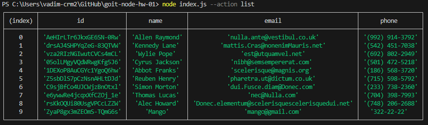

# Homework №1 Node.js

## Получаем и выводим весь список контактов в виде таблицы (console.table)

```bash
node index.js --action list
```



## Получаем контакт по id - выводим в консоль объект контакта или null, если контакта с таким id не существует.

```bash
node index.js --action get --id 05olLMgyVQdWRwgKfg5J6
```


## Добавляем контакт и выводим в консоль созданный контакт

```bash
node index.js --action add --name Mango --email mango@gmail.com --phone 322-22-22
```


## Удаляем контакт и выводим в консоль удаленный контакт или null, если контакта с таким id не существует.

```bash
node index.js --action remove --id qdggE76Jtbfd9eWJHrssH
```


